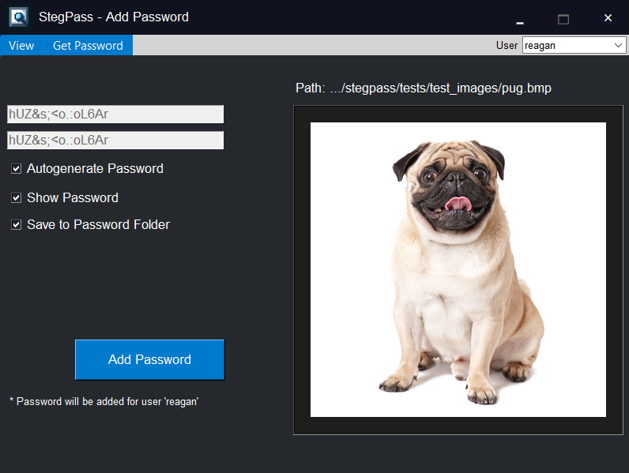

    
    <h1 style="margin-left: 20px; margin-bottom: 0;">StegPass - Password Manager</h1>

## What is it?

StegPass is a quirky password manager that stores your passwords inside everyday images. We use custom
steganography methods, to securely hide your passwords in plain site. We also use various cryptographically
secure algorithms to encrypt your passwords, greatly increasing the difficulty for an attacker to steal your
data.

## Why use it?

### 1. Security through Obscurity

No one is using StegPass, which is exactly why you should! By using StegPass you become invisible and safe
from data breaches and attacks targeting more mainstream password managers. Also, since we use custom stegonography
methods to hide your passwords, they cannot be extracted through any standard service out there.

### 2. Simplified Storage

By using stegonography to store your passwords, you can basically store your passwords wherever you want. Your
passwords aren't stored in some clustered database, making them easily accessible to you at any time. Moreover,
this decentralized approach allows you to transfer your passwords with no concerns about the medium by which 
you do it. Send your passwords in email, store them on the cloud, at the end of the day, its just an image file.

### 3. It's Fun

Add personality to your passwords, choose images that resonate with you and your relationship with whatever service
you are storing passwords for. Moreover, this adds a unique layer of security to your passwords, because perhaps 
only you can associate some image with some service. Even if a hacker could find your password in the image file, 
they would have no idea what account and website it is for (assuming those are omitted from the image and filename).

## How does it work?

Before your password is stored in any image file, you need to setup a master password (and username). This master
password is not stored anywhere, so it is important that you commit this to memory. We use this master password
in our algorithms to encrypt your other passwords. By doing this, only you have the ability to decrypt it. 
After we encrypt your passwords, we hide the encrypted byte stream as surreptitiously as we can. We hide
data inside the padding of pixels, in-between headers, trying to avoid giving any indications of file tampering. Often,
the operating system won't even detect these changes as the file size typically remains unchanged.

    

After a password is stored in an image, you can recover it at any time by clicking `Get Password` in the GUI. This will securely 
copy the password to your clipboard, and you can simply paste it into the login screen that you need it for. Your password is 
removed from the clipboard after 30 seconds, and does not get cached by any external service.

    

